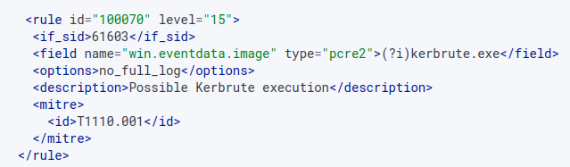
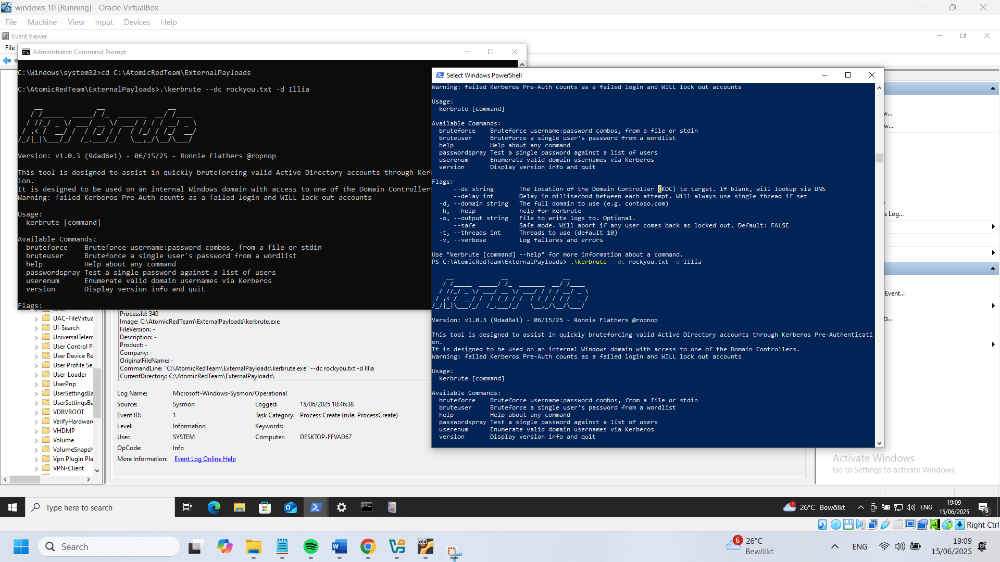
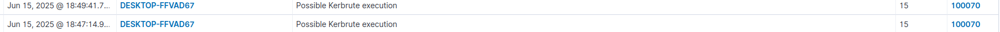
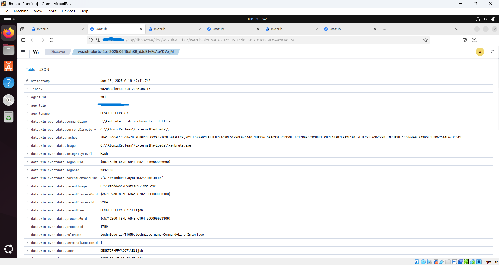
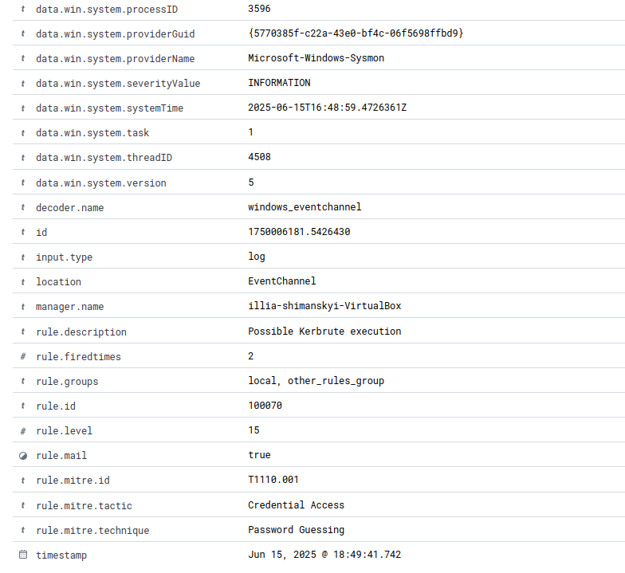

# wazuh-siem-threat-detection-lab
This is my project where I was setting up and experimented a lot with Wazuh and other stuff. The main goal for me is to set up real time security monitoring environment, using it to investigate and analyze logs.

### Lab Architecture

•	Virtual machine with Ubuntu where I have my wazuh dashboard, this dashboard is where spend most of my time looking at alerts.

• Virtual machine with Windows 10 and wazuh agent.

•	VirusTotal, will trigger more alerts that correspond to malicious files.

•	Sysmon, I needed to install Sysmon because wazuh would not detect some events by itself, e.g. some powershell scripts were not displayed in dashboard. 

### Simulated Attack Scenarios

• Suspicious PowerShell execution

• Credential access

• Privilege escalation attempt (User Account Control)

• Command and control

• Defense evaision

• Lateral movement

• VirusTotal

### Detection & Analysis

• Created custom Wazuh rules

• Tuned Sysmon configuration

• Analyzed logs in Wazuh dashboard

• Investigated suspicious IP addresses

### Example with Credential Access

Threat actors might utilize different tools and techniques to achieve access to credentials, it could be credential
guessing, spraying, cracking with tools like Hydra or Kerbrute. This test will demonstrate how to
detect such attacks on example of Kerbrute.

Now, normally attackers would use either powershell or command prompt to launch Kerbrute rather
than just clicking on it using GUI, so one way to detect its execution would be to look at powershell
and cmd command and filter by keywords like “/kerbrute.exe”. But the easier way is to create a
rule based on Sysmon event ID 1, that detects every process of creation. If that Sysmon rule will
be turned on it would create a whole lot of false positives, so it must be custom rule to detect
creation of kerbrute.exe process only.

_My custom rule_

Here is a crafted rule, has severity level of 15 that is critical, sid points to Sysmon event ID 1, that
is if Sysmon rule triggered, my rule fires instead, it looks for kerbrute.exe process and the (?i) part sets
case sensitivity because attackers can execute KERBRUTE.EXE or KerBrute.exe etc. And finally, it
indicates to id of MITRE technique that was use

Both execution with powershell and command prompt were tested, they work the same.

_Execution_

_Alert_

The alert in detail shows commandLine, hashes and location of kerbrute.exe as well as other stuff.

_Logs_

### What I Learned

• Improved understanding of Windows Event Logs

• Practical experience with detection rule tuning

• Log correlation in SIEM environment

• Importance of reducing false positives

## Full Report

Full report with 10 different attack scenarious available in **report.pdf**
